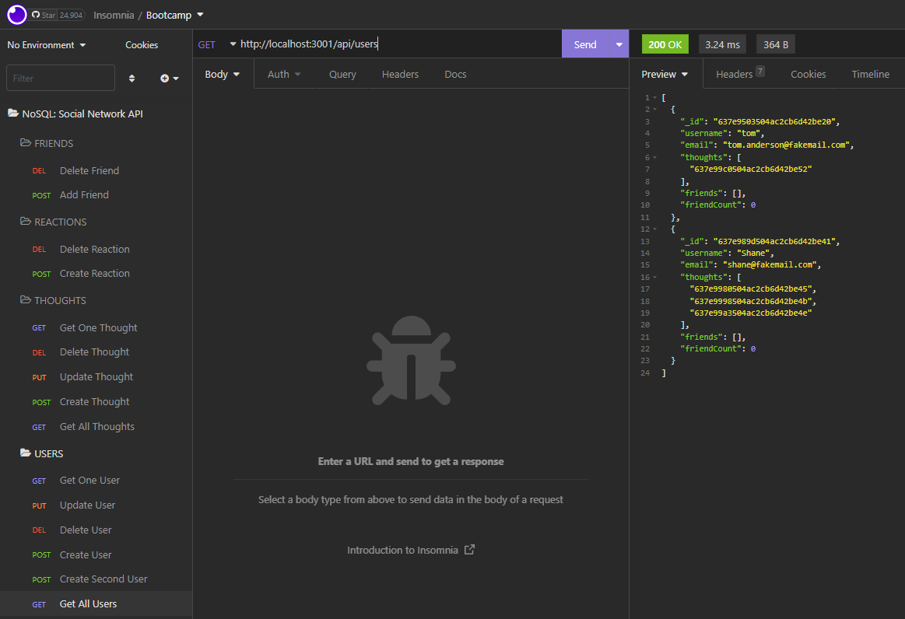

# NoSQL: Social Network API

## Table of Contents

- [Description](#description)

- [Installation](#installation)
- [Usage](#usage)
- [Demonstration](#demonstration)
- [Contact Me](#contact)

## Description:

This is the back-end infrastructure for a basic social netowrk site, allowing the CRUD operations on Users, Thoughts (posts), and Reactions (comments). Beyond JS and Node.js, it makes use of Express, MongoDB, Mongoose, as well as date-fns for date formatting.

## Installation

The project is currently back-end only, and will require local installation of MongoDB as well as the local files and dependencies. A program like Postman or Insomnia is recommended for testing request routes.

## Usage

If your database is locally configured and dependencies have been installed, you can run it from the terminal by running "npm start" or, if you have nodemon installed globally, "npm run dev" to run the server with live-updates.

## Demonstration

Click [here](https://watch.screencastify.com/v/2IhYEc0u9dfaG4wCPEZC) for a video demo.

The images below show some of the app's functionality in Insomnia.

## Contact

Please feel free to contact me if you need any further information:

- [Email](mailto:shanep42@gmail.com)
- [Github Profile](https://github.com/shanep42)
